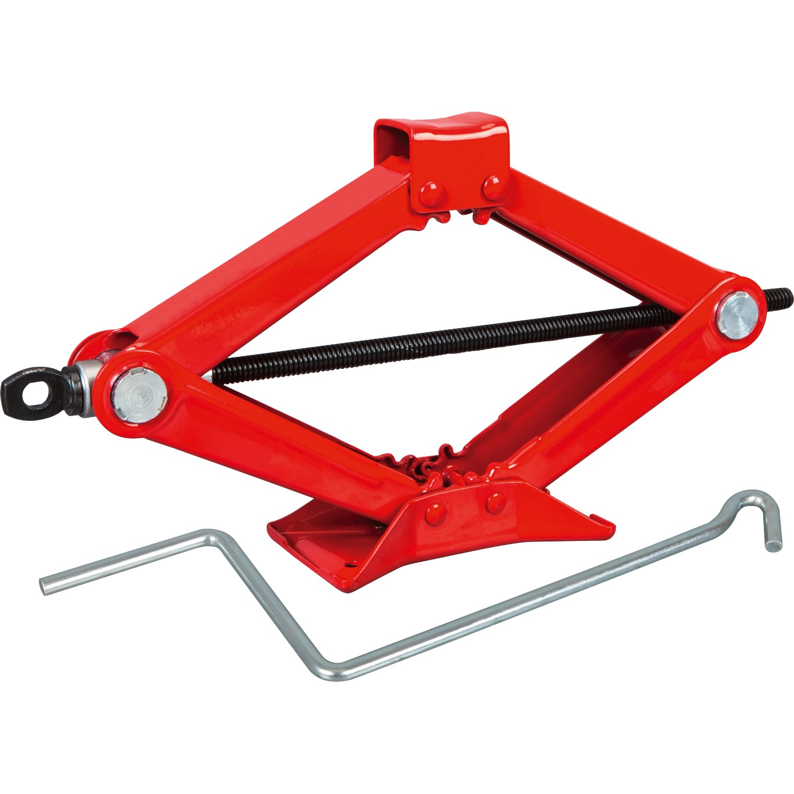
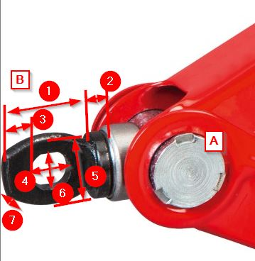
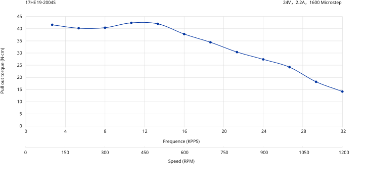
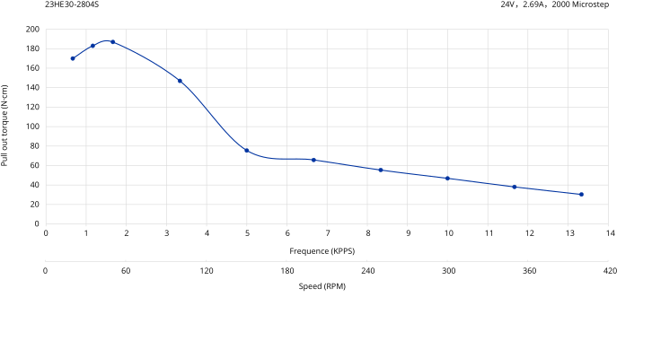
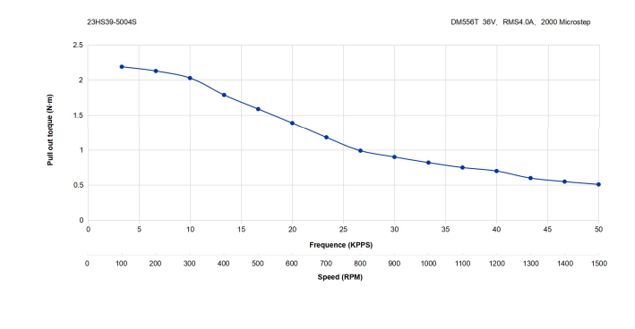

# Wheelchair Lifting System

To simulate vertical acceleration as well as nicking, gearing, and tilting, three lift devices are mounted to the wheelchair.

Scissor Jacks driven by stepper motors are used for this purpose. Two of the jacks are mounted underneath the backside wheels, one per side. The third one is mounted in the middle of the front axis to achieve a stable, three-point bearing and safe operation.

In addition, three switches shall be mounted on each lifting device to detect important positions for calibration and resetting the mechanics.

Switches shall detect the:

- lower limit position
- neutral position
- upper limit position

## Scissor Jack

The product 'B-SWH 1000' is selected for this purpose as it is robust and easily purchaseable.

### B-SWH 1000

The B-SWH 1000 is shown below:

#### Main Characteristics

The B-SWH 1000 Scissor Jack is a compact and robust lifting device designed for vehicles. Its main features include:

- **Maximum lifting capacity:** 1000 kg
- **Size** H: 100 mm × W: 443 mm × D: 120 mm
- **Lifting height range:** 100 mm to 350 mm
- **Weight:** 2.54 kg
- **Stable steel construction**

#### Detailed Characteristics

The measurements for **A** and **B** refer to image of the device detail below.

- **'A' - Diameter of Pivot Pin (front and rear):** appr. Ø 24 mm
- **'B' - Crank Eye:**
  All values have been measured manually and are therefor approximate. They may deviate between different devices.
  - **1 - Length fo Eye:** 23.0 mm
  - **2 - Width of Collar:**  6.4 mm
  - **3 - Thickness of Front Metal:**  5.7 mm
  - **4 - Length of Opening:**  12.0 mm
  - **5 - Height of Eye:**  24.5 mm
  - **6 - Height of Opening:**  11.1 mm
  - **7 - Thickness of Eye:**  6.2 mm
- **Spindle Pitch:** 2.5 mm
- **Lift Height for turn 1:** 20 mm
- **Lift Height for turn 2:** 15 mm
- **Lift Height for turn 3:** 12 mm
- **Lift Height for turn 4:** 10 mm
- **Lift Height for turn 5:** 9 mm
- **Lift Height for 1 turn at total height 250 mm:** 3 mm
- **Number of full turns:** 121

## Stepper

Different stepper motors from OEM *STEPPERONLINE* [https://www.omc-stepperonline.com/de/](https://www.omc-stepperonline.com/de/) have been tested:

### NEMA 17

#### Model 17HE19-2004S - *E Serie Nema 17 Bipolar 55Ncm(77,88 oz. in) 2A*

[17HE19-2004S Product Page](https://www.omc-stepperonline.com/e-series-nema-17-bipolar-55ncm-77-88oz-in-2a-42x48mm-4-wires-w-1m-cable-connector-17he19-2004s)

- Manufacturer Part Number: 17HE19-2004S
- Motor Type: Bipolar Stepper
- Step Angle: 1.8 deg
- Holding Torque: 55 Ncm(77.88 oz.in)
- Rated Current/phase: 2.0 A
- Torque:
    

##### Conclusion (17HE19-2004S)

Too weak for driving the jack - as expected. However, it should be sufficient to drive the rotation wheel of the simulator.

#### Model 17HS15-1584S-MG5 - *Stepper Motor L=39mm Gear Ratio 5:1 MG Series Planetary Gearbox*

- Part Number: 17HS15-1584S-MG5
- Motor Type: Bipolar Stepper
- Holding Torque without Gearbox: 36 Ncm(51.0 oz.in)
- Rated Current/phase: 1.58 A
- Gearbox Type: Spur Planetary
- Gear Ratio: 5:1
- Efficiency: 90%
- Backlash at No-load:<=30 arcmin
- Max.Permissible Torque: 9 Nm(79.66 lb-in)

##### Conclusion (17HS15-1584S-MG5)

A NEMA 17 stepper is too weak even when fitted with a gear box for driving the jack. In addition, the gear box slows down the engine.

### NEMA 23

#### Model 23HE30-2804S - *E Serie Nema 23 Bipolar 1,85Nm(261,98oz.in) 2,8A*

[23HE30-2804S Product Page](https://www.omc-stepperonline.com/e-series-nema-23-bipolar-1-8deg-1-9nm-269oz-in-2-8a-3-2v-57x57x76mm-4-wires-23he30-2804s)

- Manufacturer Part Number: 23HE30-2804S
- Number Of Phase: 2
- Step Angle: 1.8 deg
- Holding Torque: 1.85 Nm (261.98 oz.in)
- Rated Current/phase: 2.8 A
- Torque:
    

##### Conclusion (23HE30-2804S)

The stepper was able to lift a heavy weight of around 30 kg to 40 kg with the half opened scissor jack 'B-SWH 1000' at slow speed (~ 60 - 120 RPM). According to the torque curve, this stepper produces the maximum torque at this speed. This proves, that a torque of around 0.8 to 1.4 Nm is sufficient to lift the targeted load of 60 kg per jack.

However, this stepper is operating on its limits in a small speed range. Therefore a stronger stepper shall be selected, e.g. '23HS39-5004S' as described below.

#### Model 23HS39-5004S - *Nema 23 Stepper Motor Bipolar 3.00Nm(424.83oz.in) 5.0A*

[23HS39-5004S Product Page](https://www.omc-stepperonline.com/nema-23-stepper-motor-bipolar-1-8deg-3-00nm-424-83oz-in-5-0a-57x57x100mm-4-wires-23hs39-5004s)

- Manufacturer Part Number: 23HS39-5004S
- Motor Type: Bipolar Stepper
- Step Angle: 1.8 deg
- Holding Torque: 3.00 Nm(424.83 oz.in)
- Rated Current/Phase: 5.0 A
- Torque:
    

##### Conclusion (23HS39-5004S)

This stepper was not evaluated. The torque curve shows that it is capable to deliver a torque larger than 1.5 Nm for a wide speed range (up to appr. 540 RPM), which is sufficient for the use cases to achieve.

### Stepper Drivers

Different stepper drivers have been evaluated in conjunction with the evaluated stepper motors above.

#### Suitable Stepper Drivers

The steppers have eventually been evaluated with **DM542T @ 200 SPR**, which produced a working result in all configurations.

- **DM542T:**
  - Suitable for NEMA 17 and 23 steppers
  - **not suitable for NEMA 23 with higher holding torque!**
  - [DM542T Product Page](https://www.omc-stepperonline.com/digital-stepper-driver-1-0-4-2a-20-50vdc-for-nema-17-23-24-stepper-motor-dm542t)
  - Output Peak Current: 1.0~4.5 A(3.2 RMS)
  - Input Voltage: +18~50 VDC (Typical 36 VDC)
  - Logic Signal Current: 7~16 mA(Typical 10 mA)
  - Pulse Input Frequency: 0~200 kHz
  - Pulse Width: 2.5 μS
- **DM556T:**
  - Suitable for stronger NEMA 23 steppers
  - [DM556T Product Page](https://www.omc-stepperonline.com/digital-stepper-driver-1-8-5-6a-20-50vdc-for-nema-23-24-34-stepper-motor-dm556t)
  - Output Peak Current: 1.8~5.6 A (4.0 RMS)
  - Input Voltage: +20~50 VDC(Typical 24-48 VDC)
  - Logic Signal Current: 7~16 mA(Typical 10 mA)
  - Pulse Input Frequency: 0~200 kHz
  - Pulse Width: 2.5 μS

#### Insufficient Stepper Drivers

The drivers below where not able to drive any steppers without load at 1/1 microsteps (200 steps per revolution (SPR)). The stepper started to work at 1/4 microsteps (800 SPR), which slows down the operation speed and decreases the pull out torque of the system.

- TB6600: Cheap and easily available, may be OK for driving a NEMA 17 at low speed.
- DM542: Generic product
- DM542Y [Product Page](https://www.omc-stepperonline.com/y-series-digital-stepper-driver-1-0-4-2a-dc20v-50v-for-nema-17-23-24-stepper-motor-dm542y)
